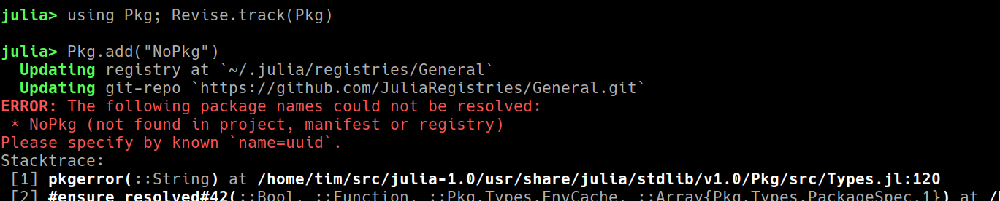
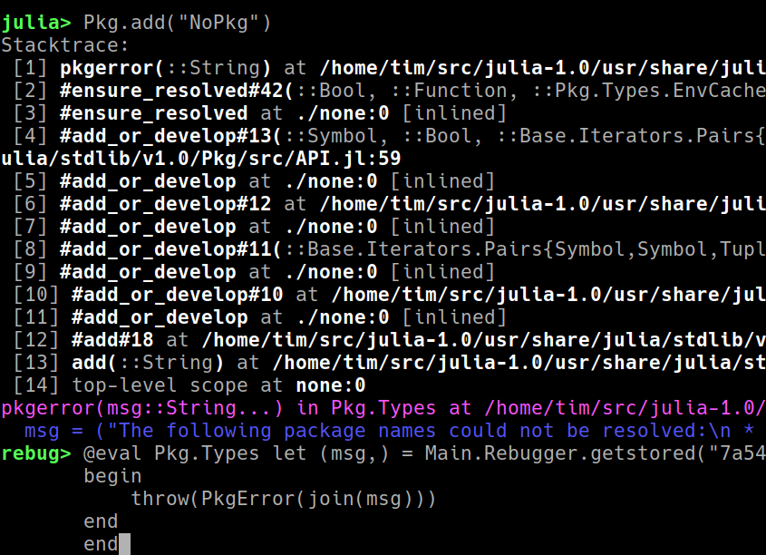

# Rebugger

Rebugger is an expression-level debugger for Julia.
It has no ability to interact with or manipulate call stacks (see [ASTInterpreter2](https://github.com/Keno/ASTInterpreter2.jl)),
but it can trace execution via the manipulation of Julia expressions.
It is in the very early stages of development, and users should currently expect bugs (please do [report](https://github.com/timholy/Rebugger.jl/issues) them).
Neverthess it may be of net benefit for some users.

The name "Rebugger" has 3 meanings:

- it is a REPL-based debugger (more on that below)
- it is the [Revise]()-based debugger
- it supports repeated-execution debugging

Documentation is sparse right now. To get you started, there are two important keybinds:

- F11 maps to "step in"
- F5 maps to "capture stacktrace" (for commands that throw an error)

## Stepping in

Select the expression you want to step into by positioning "point" (your cursor)
at the desired location in the command line:

Now if you hit F11, you should see something like this:

The magenta tells you which method you are stepping into.
The blue shows you the value(s) of any input arguments or type parameters.

Note the cursor has been moved to another `show` call. Hit F11 again.
Now let's illustrate another important display item: if you position your cursor
as shown and hit F11 again, you should get the following:

Note the yellow/orange line: this is a warning message, and you should pay attention to these.
In this case the call actually enters `show_vector`; if you moved your cursor there,
you could trace execution more completely.

## Capturing stacktraces

Choose a command that throws an error, for example:

Enter the command again, and this time hit F5:

Hit enter and you should see the error again, but this time with a much shorter
stacktrace.
That's because you entered at the top of the stacktrace.

You can use your up and down errors to step through the history, which corresponds
to going up and down the stack trace.

## Known issues

There are *many*. A few selected items:

- F5 sometimes doesn't work when your cursor is at the end of the line.
  Move your cursor anywhere else in that line and try again.
- Revise must be tracking the package/stdlib for any of this to work.
  Note the `Revise.track(Pkg)` line in the demo above.
  One exception is Base, for which tracking will be initiated automatically.
  For script use `includet(filename)` to include-and-track.
- There are known glitches in the display. When capturing stack traces, hit
  enter on the first one to rethrow the error before trying the up and down arrows
  to navigate the history---that seems to reduce the glitching.
  (For brave souls who want to help fix these,
  see [HeaderREPLs.jl](https://github.com/timholy/HeaderREPLs.jl))
- You cannot step into methods defined at the REPL.
