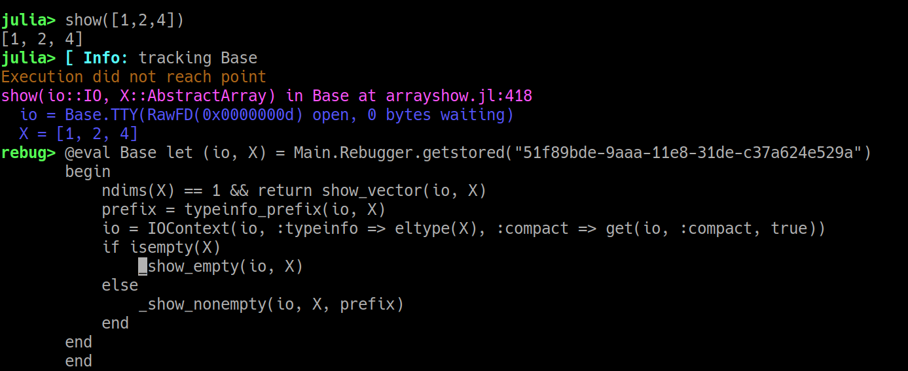

# Usage

Rebugger works from Julia's native REPL prompt. Currently there are two important keybindings:

- Alt-e maps to "enter" or "step in"
- Alt-s maps to "stacktrace" (for commands that throw an error)

If you're on OSX, you may want to enable 
"[Use `option` as the Meta key](https://github.com/timholy/Rebugger.jl/issues/28#issuecomment-414852133)"
in your Terminal settings to avoid the need to press Esc before each Rebugger command.

## Stepping in

Select the expression you want to step into by positioning "point" (your cursor)
at the desired location in the command line:

```@raw html

```

Now if you hit Alt-e, you should see something like this:

```@raw html

```

The cyan "Info" line is an indication that the method you're stepping into is
a function in Julia's Base module; this is shown by Revise (not Rebugger), and only happens
once per session.

The remaining lines correspond to the Rebugger header and user input.
The magenta line tells you which method you are stepping into.
Indented blue line(s) show the value(s) of any input arguments or type parameters.

If you're following along, move your cursor to the next `show` call as illustrated above.
Hit Alt-e again. You should see a new `show` method, this time with two input arguments.

Now let's demonstrate another important display item: position your cursor at the
beginning of the `_show_empty` call and hit Alt-e.
The display should now look like this:

```@raw html

```

This time, note the yellow/orange line: this is a warning message, and you should pay attention to these.
(You might also see red lines, which are generally more serious "errors.")
In this case the call actually enters `show_vector`; if you moved your cursor there,
you could trace execution more completely.

Having illustrated the importance of "point" and the various colors used for messages from Rebugger,
to ensure readability the remaining examples will be rendered as text.

## Capturing stacktraces

For a quick demo, we'll use the `Colors` package (`add` it if you don't have it)
and deliberately choose a method that will end in an error: we'll try to parse
a string as a Hue, Saturation, Lightness (HSL) color, except we'll "forget" that hue
is not expressed as a percentage:

```julia
julia> using Colors

julia> colorant"hsl(80%, 20%, 15%)"
ERROR: LoadError: hue cannot end in %
Stacktrace:
 [1] error(::String) at ./error.jl:33
 [2] parse_hsl_hue(::SubString{String}) at /home/tim/.julia/dev/Colors/src/parse.jl:26
 [3] _parse_colorant(::String) at /home/tim/.julia/dev/Colors/src/parse.jl:75
 [4] _parse_colorant at /home/tim/.julia/dev/Colors/src/parse.jl:112 [inlined]
 [5] parse(::Type{Colorant}, ::String) at /home/tim/.julia/dev/Colors/src/parse.jl:140
 [6] @colorant_str(::LineNumberNode, ::Module, ::Any) at /home/tim/.julia/dev/Colors/src/parse.jl:147
in expression starting at REPL[3]:1
```

Now hit the up arrow and then Alt-s. After a short delay, you should see something like this:
```julia
julia> colorant"hsl(80%, 20%, 15%)"
┌ Warning: Tuple{getfield(Colors, Symbol("#@colorant_str")),LineNumberNode,Module,Any} was not found, perhaps it was generated by code
└ @ Revise ~/.julia/dev/Revise/src/Revise.jl:614
Captured elements of stacktrace:
[1] parse_hsl_hue(num::AbstractString) in Colors at /home/tim/.julia/dev/Colors/src/parse.jl:25
[2] _parse_colorant(desc::AbstractString) in Colors at /home/tim/.julia/dev/Colors/src/parse.jl:51
[3] parse(::Type{C}, desc::AbstractString) where C<:Colorant in Colors at /home/tim/.julia/dev/Colors/src/parse.jl:140
parse_hsl_hue(num::AbstractString) in Colors at /home/tim/.julia/dev/Colors/src/parse.jl:25
  num = 80%
rebug> @eval Colors let (num,) = Main.Rebugger.getstored("c592f0a4-a226-11e8-1002-fd2731558606")
       begin
           if num[end] == '%'
               error("hue cannot end in %")
           else
               return parse(Int, num, base=10)
           end
       end
       end
```

Now you can navigate with your up and down arrows to browse the captured stacktrace.
You can pick any of these expressions to execute (hit Enter) or edit before execution.
For example you could add `@show` commands to examine intermediate variables or test
out different ways to fix a bug.
You can use the REPL history to test the results of many different changes to the same "method";
the "method" will be run with the same inputs each time.

## Important notes

### "Missing" methods from stacktraces

In the example above, you may have noticed the warning about the `@colorant_str` macro
being omitted from the "captured" (interactive) expressions comprising the stacktrace.
Macros are not traced.
Also notice that the inlined method does not appear in the captured stacktrace.
However, you can enter an inlined method using "step in," starting from the method
above it in the stacktrace.

When many methods use keyword arguments, the apparent difference between the
"real" stacktrace and the "captured" stacktrace can be quite dramatic:

```julia
julia> using Pkg

julia> Pkg.add("NoPkg")
  Updating registry at `~/.julia/registries/General`
  Updating git-repo `https://github.com/JuliaRegistries/General.git`
ERROR: The following package names could not be resolved:
 * NoPkg (not found in project, manifest or registry)
Please specify by known `name=uuid`.
Stacktrace:
 [1] pkgerror(::String) at /home/tim/src/julia-1.0/usr/share/julia/stdlib/v1.0/Pkg/src/Types.jl:120
 [2] #ensure_resolved#42(::Bool, ::Function, ::Pkg.Types.EnvCache, ::Array{Pkg.Types.PackageSpec,1}) at /home/tim/src/julia-1.0/usr/share/julia/stdlib/v1.0/Pkg/src/Types.jl:890
 [3] #ensure_resolved at ./none:0 [inlined]
 [4] #add_or_develop#13(::Symbol, ::Bool, ::Base.Iterators.Pairs{Union{},Union{},Tuple{},NamedTuple{(),Tuple{}}}, ::Function, ::Pkg.Types.Context, ::Array{Pkg.Types.PackageSpec,1}) at /home/tim/src/julia-1.0/usr/share/julia/stdlib/v1.0/Pkg/src/API.jl:59
 [5] #add_or_develop at ./none:0 [inlined]
 [6] #add_or_develop#12 at /home/tim/src/julia-1.0/usr/share/julia/stdlib/v1.0/Pkg/src/API.jl:29 [inlined]
 [7] #add_or_develop at ./none:0 [inlined]
 [8] #add_or_develop#11(::Base.Iterators.Pairs{Symbol,Symbol,Tuple{Symbol},NamedTuple{(:mode,),Tuple{Symbol}}}, ::Function, ::Array{String,1}) at /home/tim/src/julia-1.0/usr/share/julia/stdlib/v1.0/Pkg/src/API.jl:28
 [9] #add_or_develop at ./none:0 [inlined]
 [10] #add_or_develop#10 at /home/tim/src/julia-1.0/usr/share/julia/stdlib/v1.0/Pkg/src/API.jl:27 [inlined]
 [11] #add_or_develop at ./none:0 [inlined]
 [12] #add#18 at /home/tim/src/julia-1.0/usr/share/julia/stdlib/v1.0/Pkg/src/API.jl:69 [inlined]
 [13] add(::String) at /home/tim/src/julia-1.0/usr/share/julia/stdlib/v1.0/Pkg/src/API.jl:69
 [14] top-level scope at none:0

julia> Pkg.add("NoPkg")  # hit Alt-s here
Captured elements of stacktrace:
[1] pkgerror(msg::String...) in Pkg.Types at /home/tim/src/julia-1.0/usr/share/julia/stdlib/v1.0/Pkg/src/Types.jl:120
[2] ensure_resolved(env::Pkg.Types.EnvCache, pkgs::AbstractArray{Pkg.Types.PackageSpec,1}) in Pkg.Types at /home/tim/src/julia-1.0/usr/share/julia/stdlib/v1.0/Pkg/src/Types.jl:860
[3] add_or_develop(ctx::Pkg.Types.Context, pkgs::Array{Pkg.Types.PackageSpec,1}) in Pkg.API at /home/tim/src/julia-1.0/usr/share/julia/stdlib/v1.0/Pkg/src/API.jl:32
[4] add_or_develop(pkgs::Array{String,1}) in Pkg.API at /home/tim/src/julia-1.0/usr/share/julia/stdlib/v1.0/Pkg/src/API.jl:28
[5] add(args...) in Pkg.API at /home/tim/src/julia-1.0/usr/share/julia/stdlib/v1.0/Pkg/src/API.jl:69
pkgerror(msg::String...) in Pkg.Types at /home/tim/src/julia-1.0/usr/share/julia/stdlib/v1.0/Pkg/src/Types.jl:120
  msg = ("The following package names could not be resolved:\n * NoPkg (not found in project, manifest or registry)\nPlease specify by known `name=uuid`.",)
rebug> @eval Pkg.Types let (msg,) = Main.Rebugger.getstored("b5c899c2-a228-11e8-0877-d102334a9f65")
       begin
           throw(PkgError(join(msg)))
       end
       end
```

Note that only five methods got captured but the stacktrace is much longer.
Most of these methods, however, start with `#`, an indication that they are
generated methods rather than ones that appear in the source code.
The interactive stacktrace visits only those methods that appear in the original source code.

!!! note
    `Pkg` is one of Julia's standard libraries, and to step into or trace Julia's stdlibs
    you must build Julia from source.


### Modified "signatures"

Some "methods" you see in the `let` block on the command line will have their
"signatures" slightly modified.
For example:

```julia
julia> dest = zeros(3);

julia> copyto!(dest, 1:4)
ERROR: BoundsError: attempt to access 3-element Array{Float64,1} at index [1, 2, 3, 4]
Stacktrace:
 [1] copyto!(::IndexLinear, ::Array{Float64,1}, ::IndexLinear, ::UnitRange{Int64}) at ./abstractarray.jl:728
 [2] copyto!(::Array{Float64,1}, ::UnitRange{Int64}) at ./abstractarray.jl:723
 [3] top-level scope at none:0

julia> copyto!(dest, 1:4)  # hit Alt-s here
Captured elements of stacktrace:
[1] copyto!(::IndexStyle, dest::AbstractArray, ::IndexStyle, src::AbstractArray) in Base at abstractarray.jl:727
[2] copyto!(dest::AbstractArray, src::AbstractArray) in Base at abstractarray.jl:723
copyto!(::IndexStyle, dest::AbstractArray, ::IndexStyle, src::AbstractArray) in Base at abstractarray.jl:727
  __IndexStyle_1 = IndexLinear()
  dest = [0.0, 0.0, 0.0]
  __IndexStyle_2 = IndexLinear()
  src = 1:4
rebug> @eval Base let (__IndexStyle_1, dest, __IndexStyle_2, src) = Main.Rebugger.getstored("21a8ab94-a228-11e8-0563-256e39b3996e")
       begin
           (destinds, srcinds) = (LinearIndices(dest), LinearIndices(src))
           isempty(srcinds) || (checkbounds(Bool, destinds, first(srcinds)) && checkbounds(Bool, destinds, last(srcinds)) || throw(BoundsError(dest, srcinds)))
           @inbounds for i = srcinds
                   dest[i] = src[i]
               end
           return dest
       end
       end
```

Note that this `copyto!` method contains two anonymous arguments annotated `::IndexStyle`.
Rebugger will make up names for these arguments (here `__IndexStyle_1` and `__IndexStyle_2`).
While these will be distinct from one another, Rebugger does not check whether they
conflict with any internal names.

!!! note
    This example illustrates a second important point: you may have noticed that this one was
    considerably slower to print.
    That's because capturing stacktraces overwrites the methods involved.
    Since `copyto!` is widely used, this forces recompilation of a lot
    of methods in Base.

    In contrast with capturing stacktraces, stepping in does not overwrite methods,
    so is sometimes preferred.

